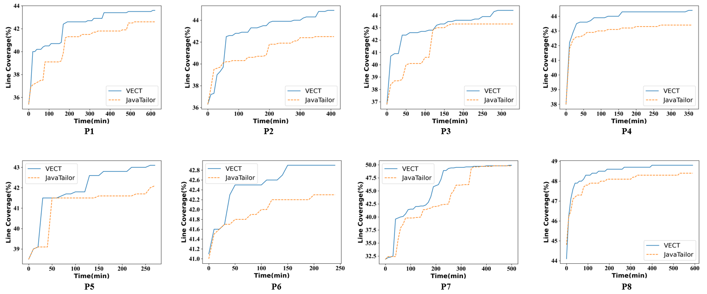

Figure 1: Line coverage trend on benchmark P1-P8

To better answer the RQ3 in VECT, we further analyzed the trend of line coverage for each benchmark. The specific results are shown in Figure 1, where the results of sub figures (a) - (h) correspond to benchmark P1 - P8 respectively and the x-axis of sub figure represents the testing time while the y-axis represents the achieved line coverage.

From this figures, VECT achieves higher JVM line coverage than JavaTailor most of the time, and the conclusions are almost consistent. Before collecting line coverage, VECT first executes each seed program once to ensure that the initial coverage is the same. In the sub figure (b), except at the very early stage where the feedback-driven selection strategy does not learn too much, the trend of VECT is similar to other benchmark. And VECT uses a lot of resources to synthesize test cases that does not help to cover new line, even lower than the line coverage of JavaTailor.  The reason for result of P7 is that both the ingredient pool and the seed programs are from the same test programs, which lead to VECT and JavaTailor can end up with similar line coverage.
